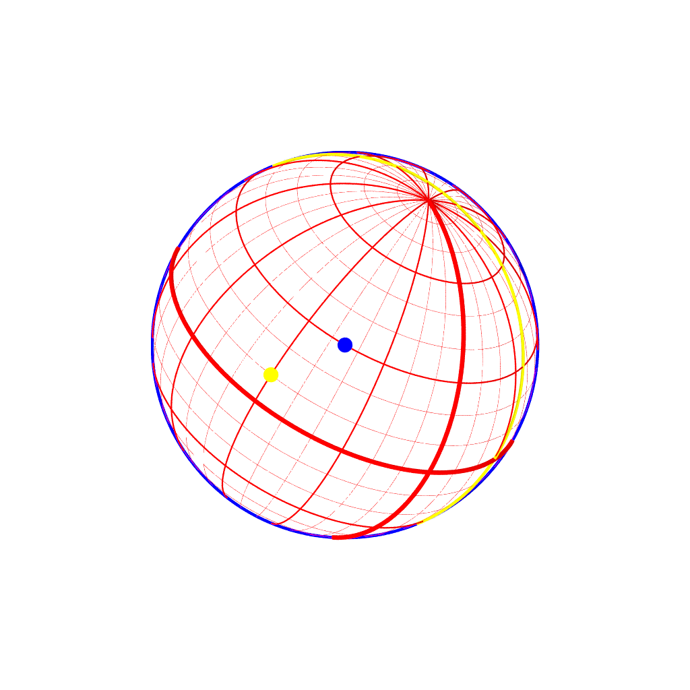

ISS Titan grid using povray
============================

Usage:
```bash
python titan_grid.py filename SC_lat SC_lon SS_lat SS_lon dist north [NAC|WAC]
```

Example:
```bash
python titan_grid.py Test_img.png 30 45 10 60 1.5e6 30
```

Output:


> **Warning**
>
> The longitude are given as _WEST_ longitudes.

> **Notes**
>
> - The `NAC/WAC` parameter is optinal, `NAC` is selected by default.
> - The image is centerd on Titan ([512.5,512.5] in pixel frame). You need to shift the image according to the real position of Titan on the sensor.
